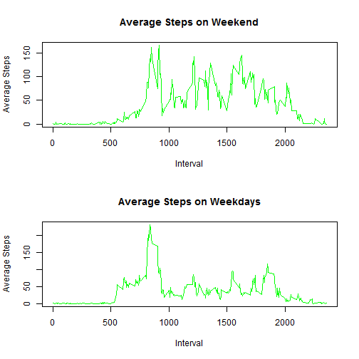

# Reproducible Research: Peer Assessment 1

## This document contains the description of all the steps performed to answer the assignment questions. It it involves analysis of a personal activity monitoring data collected for one person over the interval of two months of October and November, 2012. The dataset analyzed covers the individuals' number of steps taken in 5 minute intervals each day of the measurement period.

## 1) Loading and preprocessing the data

## a) It is necessary to load the plyr package:

```r
library(plyr)
```


## b) Loading the data, converting dates into the "date" type and transforming the interval data:
## Note: it is necessary to have the file "activity.csv" in the workingdirectory

```r
data <- read.csv("activity.csv")
data$date <- as.Date(data$date)
data$interval <- formatC(data$interval, width = 4, flag = 0)
```


## c) Checking the dataset:

```r
head(data)
```

```
##   steps       date interval
## 1    NA 2012-10-01     0000
## 2    NA 2012-10-01     0005
## 3    NA 2012-10-01     0010
## 4    NA 2012-10-01     0015
## 5    NA 2012-10-01     0020
## 6    NA 2012-10-01     0025
```


## 2) What is mean total number of steps taken per day?
## a) Making a histogram of the total number of steps taken each day:

```r
NoStepPerDay <- ddply(data, "date", summarise, TotSteps = sum(steps))
with(NoStepPerDay, hist(TotSteps, col = "green", main = "Steps Per Day", xlab = "Total number of steps for each day"))
```

 


## b) Calculation of the mean and median of total number of steps taken per day:

```r
AVGTotSteps <- mean(NoStepPerDay$TotSteps, na.rm = TRUE)
MedTotSteps <- median(NoStepPerDay$TotSteps, na.rm = TRUE)
```


## c) Showing the results:

```r
AVGTotSteps
```

```
## [1] 10766
```

```r
MedTotSteps
```

```
## [1] 10765
```


## 3) What is the average daily activity pattern?
## a) Plotting the average number of steps for each 5-minute interval,
## note: I do not distinguish between weekdays
```
AVGStepPerInterval <- ddply(data, "interval", summarise, AVGStepPerInterval = mean(steps, na.rm = TRUE))
with(AVGStepPerInterval, plot(interval, AVGStepPerInterval, col="green", type = "l", xlab = "Interval", ylab = "Average Steps Per Interval", main = "Average Steps Per Interval"))
maxInterval <- AVGStepPerInterval$interval[which.max(AVGStepPerInterval$AVGStepPerInterval)]
```

## b) Writing the 5-min interval with most average steps across all days:

```r
maxInterval
```

```
## [1] "0835"
```


## 4) Imputing missing values
## a) Calculating the number of missing values:
```
NoMissing <- sum(is.na(data$steps))
```

## b) Reporting the total number of values missing from the dataset:

```r
NoMissing
```

```
## [1] 2304
```

## c) Creating a new dataset that is equal to the original dataset but with the missing data filled in.
## For missing number of steps imputation, NAs are replaced with the 5-min mean of steps for corresponding interval
## Creating a variable "imputeData", we add a column of mean for the particular intervals and replace NAs by those averages everywhere where there are missing values.

```r
imputeData <- data
imputeData <- merge(imputeData, AVGStepPerInterval, sort = TRUE)
imputeData$steps[is.na(imputeData$steps)] <- imputeData$AVGStepPerInterval[is.na(imputeData$steps)]
```


## d) Making a histogram of the total number of steps taken each day:

```r
NoStepPerDayImpute <- ddply(imputeData, "date", summarise, TotSteps = sum(steps))
with(NoStepPerDayImpute, hist(TotSteps, col = "green", main = "Total number of steps taken each day (with imputed missing values)", 
    xlab = "Total number of steps taken each day"))
```

 


## e) Calculating the mean and median total number of steps taken per day based on the imputed dataset.

```r
AVGTotSteps_Impute = mean(NoStepPerDayImpute$TotSteps)
MedTotSteps_Impute = median(NoStepPerDayImpute$TotSteps)
```


## f) Reporting the results:

```r
AVGTotSteps_Impute
```

```
## [1] 10766
```

```r
MedTotSteps_Impute
```

```
## [1] 10766
```


## Imputing missing data does not change the mean (since I use means for imputation). The effect of the imputation on median is minimal.

## 5) Are there differences in activity patterns between weekdays and Weekend?
## a) Creating a new factor variable with two levels -- "weekday" and "weekend" indicating whether a given date is a weekday or weekend day.

```r
finalData <- imputeData
finalData <- ddply(finalData, "date", transform, day = weekdays(date))
Weekend <- finalData$day == "neděle" | finalData$day == "sobota"
finalData$subset <- "weekend"
finalData$subset[!Weekend] <- "weekday"
finalData$subset <- as.factor(finalData$subset)
```


## b) Splitting the data to Weekend and weekdays, and calculating the mean and median total number of steps taken per day for each of the two new datasets.

```r
Weekend <- finalData[finalData$subset == "weekend", ]
AVGWeekend <- ddply(Weekend, "interval", summarise, avgSteps = mean(steps))
weekdays <- finalData[finalData$subset == "weekday", ]
AVGWeekdays <- ddply(weekdays, "interval", summarise, avgSteps = mean(steps))
```


## c) Plotting these datasets to see wheather their pattern differs between weekdays and Weekend:

```r
par(mfrow = c(2, 1))
with(AVGWeekend, plot(interval, avgSteps, col = "green", type = "l", xlab = "Interval", 
    ylab = "Average Steps", main = "Average Steps on Weekend"))
with(AVGWeekdays, plot(interval, avgSteps, col = "green", type = "l", xlab = "Interval", 
    ylab = "Average Steps", main = "Average Steps on Weekdays"))
```

 


## The pattern is significantly different on Weekend - person gets up later and walking more during the day.
